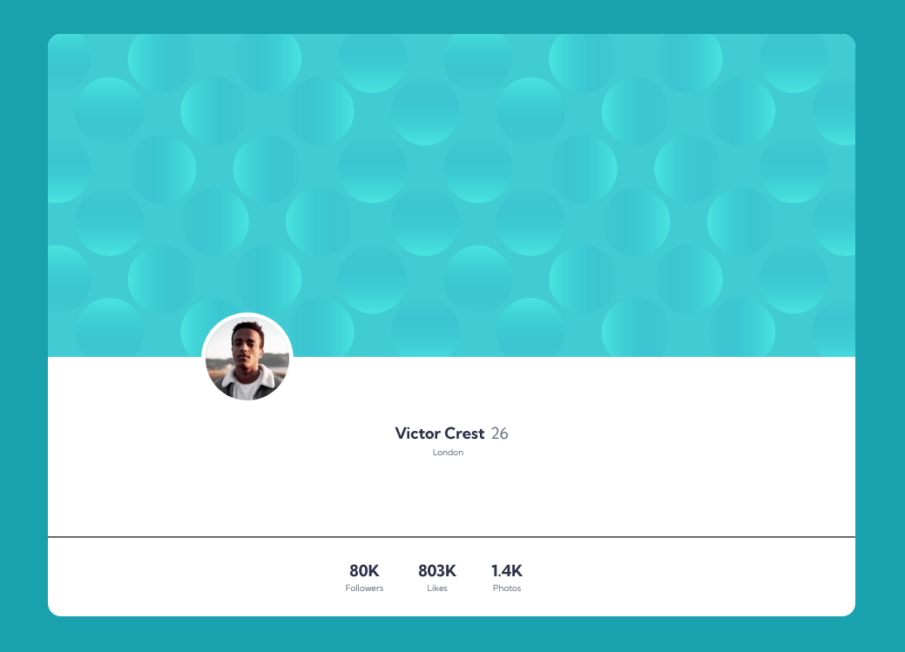

# Frontend Mentor - Profile card component solution

This is a solution to the [Profile card component challenge on Frontend Mentor](https://www.frontendmentor.io/challenges/profile-card-component-cfArpWshJ). Frontend Mentor challenges help you improve your coding skills by building realistic projects. 

## Table of contents

- [Overview](#overview)
  - [The challenge](#the-challenge)
  - [Screenshot](#screenshot)
  - [Links](#links)
- [My process](#my-process)
  - [Built with](#built-with)
  - [What I learned](#what-i-learned)
  - [Continued development](#continued-development)
  - [Author](#author)

## Overview

### The challenge

- Build out the project to the designs provided

### Screenshot

### Links

- Solution URL: [Add solution URL here](https://your-solution-url.com)
- Live Site URL: [Add live site URL here](https://your-live-site-url.com)

## My process

### Built with

- Semantic HTML5 markup
- SCSS custom properties
- Flexbox

### What I learned

I learned to keep an eye on even the little things as they can cause unforseen problems easily. Just to name one, I had a couple of variables set up to hold my font sizes but because I was importing the index file for the section where I use the variables before the one where the variable was declared, SASS was giving me an error because I was trying to call a variable before it had been declared.

### Continued development

Going forward, I want to refine my SASS skills and improve at nesting and reducing my code down to be less repetitive as I still have problems with repeating myself in CSS when I could just be calling a mixin or something similar.

## Author

- Website - [Shaun Pour](https://shaunpourdev.com)
- Frontend Mentor - [@DarkPhoenixNinja92](https://www.frontendmentor.io/profile/DarkPhoenixNinja92)
- GitHub - [@DarkPhoenixNinja92](https://github.com/DarkPhoenixNinja92/)